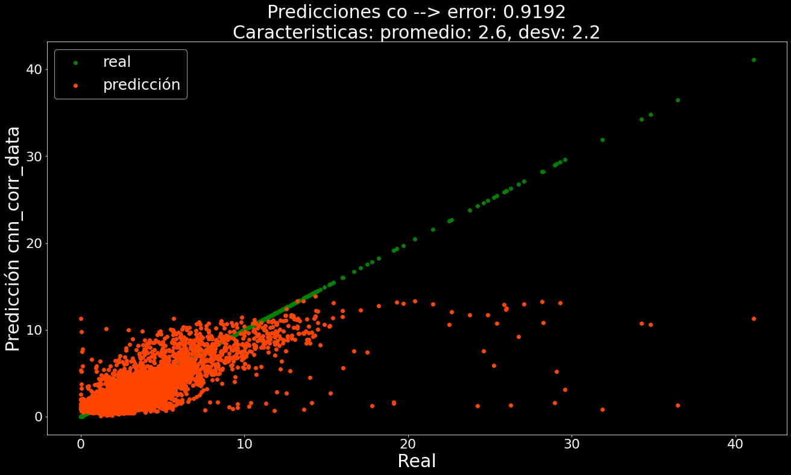

#  NOX-and-CO-emissions

Esta en desarrollo, este repo, quedan partes por implementar ...

### Documentación

Documentación de los modulos con sphinx 

```sh
build/html/index.html
```


## Instalar las librerías necesarias para trabajar con deepAR en gluonts
```sh
$ git clone https://github.com/matheus695p/nox-and-co-emissions.git
$ cd nox-and-co-emissions
$ pip install -r requirements.txt
```

tree del proyecto

```sh
│   .gitignore
│   README.md
│   requirements.txt
│
├───codes
│       cleaning.py
│       open.py
│       preprocessing.py
│       train_cnn.py
│       train_nn.py
│
├───data
│   │   data.csv
│   │   gt_2011.csv
│   │   gt_2012.csv
│   │   gt_2013.csv
│   │   gt_2014.csv
│   │   gt_2015.csv
│   │   raw_data.csv
│   │
│   └───featured
│           featured_0_5.csv
│           featured_0_55.csv
│           featured_0_6.csv
│           featured_0_65.csv
│           featured_0_7.csv
│           featured_0_75.csv
│           featured_0_8.csv
│           featured_0_85.csv
│           featured_0_9.csv
│           featured_data.csv
│
├───documents
│       environmental pollution prediction.pdf
│       predicting-co-and-nox-emissions-from-gas-turbines-novel-data-and-2019.pdf
│
├───results
│   │   resultados.png
└───src
        clean_module.py
        config_cnn.py
        config_nn.py
        evaluation_module.py
        open_module.py
        preprocessing_module.py
        utils.py
        visualizations.py
        __init__.py

```

# Introducción:

Los sistemas de monitoreo predictivo de emisiones (PEMS) son herramientas importantes para la validación y respaldo de costosos sistemas de monitoreo continuo de emisiones utilizados en centrales eléctricas basadas en turbinas de gas. Su implementación se basa en la disponibilidad de datos apropiados y ecológicamente válidos (superintendencia de medio ambiente debe estar de acuerdo). En este repositorio, usamos un conjunto de datos PEMS

* https://archive.ics.uci.edu/ml/datasets/Gas+Turbine+CO+and+NOx+Emission+Data+Set

Los cuales contienen 5 años de información de una turbina de gas para de CO y NOx. Analizamos los datos utilizando deep learning para presentar información útil sobre las predicciones de emisiones. Además, presentamos un procedimiento experimental de referencia para la comparabilidad de trabajos futuros.


Para hacer reproducibles los resultados al igual que en los papers se hará testing con los años 2014 y 2015.


## Diccionario de datos

Features:
* Variable (Abbr.) Unit Min Max Mean
* Ambient temperature (AT) °C
* Ambient pressure (AP) mbar 
* Ambient humidity (AH) (%) 
*  Air filter difference pressure (AFDP) mbar 
* Gas turbine exhaust pressure (GTEP) mbar 
* Turbine inlet temperature (TIT) °C 
*  Turbine after temperature (TAT) °C
* Compressor discharge pressure (CDP) mbar 
* Turbine energy yield (TEY) MWH 

Targets:
* Carbon monoxide (CO) mg/m3 
* Nitrogen oxides (NOx) mg/m3 

## Interpretación física

<p align="center">
  
</p>


# Análisis

La idea con la que trataré el problema será:

* clean data: valores faltantes, vacios, 
* preprocessing: EDA, ordenar y dejar listo para etapa de feature engineering
* feature engineering: lag values, log(x), log(lag(x)), analisis de correlación por pearson, eliminando columnas que estén altamente correlacionadas 
* neural nets: redes dense, diferentes arquitecturas en los dataset tratados para distintos valores threshold de correlación entre columnas
* conv nets: redes convolucionales para hacer el end-to-end de la selección de caracteristicas

## EDA:

Veamos desbalance en la data en las columnas target:


<p align="center">
  
</p>


Kernel distributions estimations:


<p align="center">
  
</p>


Distribución de las características de train y test:

[](https://user-images.githubusercontent.com/61805388/114316484-c7735980-9ad1-11eb-8d2d-1f4f0a43d09a.mp4)

https://user-images.githubusercontent.com/61805388/114316484-c7735980-9ad1-11eb-8d2d-1f4f0a43d09a.mp4


## Feature Engineering:

Feeature engineering:
* lag values: dado que estos corresponden a datos de series de tiempo, utilizamos los valores pasados en la predicción actual (ejemplo: temperatura t depende de t-1 (transferencia de calor))
* log(x): aplicamos logaritmo en las columnas de forma de estandarizar los valores
* log(lag(x)): aplicamos logaritmo en las columnas laggeadas de forma de estandarizar los valores
* analisis de correlación por pearson: esto permite crear múltiples datasets en los que las redes son evaluadas, eliminando columnas que estén altamente correlacionadas de acuerdo a un threshold de correlación entre 0.5 y 0.95


## NN implementación

Con el fin de evaluar los datasets generados anteriormente y seleccionar caracteristicas con las que se va a trabajar y establecer modelos baseline con el approach de deep learning, se evaluan 3 arquitecturas en todos los dataset. Los resultados son mostrados a continuación.


### Arquitecturas probadas

Las arquitecturas implementadas fueron:

<p align="center">
  
</p>

Para la prevención de overfitting se usan capas de regularización con dropout y batchnormalization, además, se ocupan los callbacks de reduce learning rate on plateau y early stopping para detener los entrenamientos en los momentos antes del sobreajuste y rescatando los mejores pesos del error de validación.


El config de hiper-parámetros de la red están en el script:

```sh
src/config_nn.py
```

### Resultados baseline

Para CO (monoxido de carbono) se llega a los siguientes resultados:


<p align="center">
  
</p>


Un mae de 0.8314 con el dataset con un threshold de correlación de 0.9 y usando la arquitectura número 1 de la figura anterior, este resultado mismo si es baseline, encontró mejores resultados que en los trabajos [1], [2], [3] y [4], más adelante se analiza el ¿porque?


Para NOX (óxidos de nitrogeno), no fue tan buena el resultado comparado con [1], que sigue siendo quien obtuvo una puntación de MAE: 7.91, mientras que el mejor resultaod se alcanzó con la arquitectura número 2 y con el dataset con treshold de 0.8 un MAE : 9.251. Por lo cual nos queda por mejorar


<p align="center">
  
</p>


Los conclusiones de las pruebas del baseline fueron, que las redes 


## CNN implementación

Con el proposito de resolver el problema end-to-end, sin pasar, entregamos el dataset con las 234 caracteristicas a una red CNN que actuara como extractor de caracteristicas para regresión lineal, esto con el fin de no tener que preocuparnos por seleccionar las mejores caracteristicas.


### Arquitectura usada como baseline

La arquitectura de CNN propuesta toma lo matrices de 1 canal (psedo imagenes de 1 color) como entrada. La arquitectura propuesta para la extracción de características tiene el siguiente esquema. Cada vector que antes entraba a la red Dense, ahora se transforma en una matriz de (13, 18).

* Primera arquitectura


<p align="center">
  
</p>


* Segunda arquitectura


<p align="center">
  
</p>


### Baseline CNN como extractor de caracteristicas

Para el caso anterior de redes neuronales fully connected, fueron dos las arqutiecturas que entregaron un buen resultado y que por separado eran los mejoras. Las CNN es una sola arquitectura, que plantea resultados bastante interesantes


1) Arquitectura

<p align="center">
  
</p>


<p align="center">
  
</p>


2) Arquitectura

<p align="center">
  
</p>


<p align="center">
  
</p>


# Bibliografía


[1] Kaya, H., TÜFEKCİ, P., & Uzun, E. (2019). Predicting co and no x emissions from gas turbines: novel data and a benchmark pems. Turkish Journal of Electrical Engineering & Computer Sciences, 27(6), 4783-4796.


[2] Skalska K, Miller JS, Ledakowicz S. Trends in NOx abatement: a review. Science of the Total Environment 2010; 408 (19): 3976-3989. doi: 10.1016/j.scitotenv.2010.06.001


[3] Shakil M, Elshafei M, Habib MA, Maleki F, Soft sensor for NOx and O2 using dynamic neural networks. Computers & Electrical Engineering 2009; 35 (4): 578-586. doi: 10.1016/j.compeleceng.2008.08.007


[4] MINXING SI, TYLER J. TARNOCZI, BRETT M. WIENS, AND KE DU, Development of Predictive Emissions Monitoring System Using Open Source Machine Learning Library – Keras: A Case Study on a Cogeneration Unit, IEEE Access, VOLUME 7, 2019
